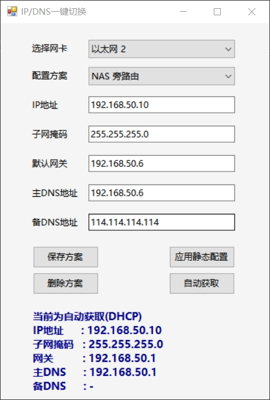

# IP DNS Switcher

简体中文 | [English](#Introduction)

## 简介

**IP DNS Switcher** 是一个基于 Windows Forms 的小工具，方便用户在多组本地有线网络配置（IP、子网掩码、网关、DNS）之间一键切换。适用于经常在不同网络环境（如需要切换旁路由等）的用户。

❗ <mark>**此工具由AI生成。** <mark>

## 主要功能

- 支持多组网络配置方案的保存、切换和删除
- 支持静态 IP/DNS 设置与自动（DHCP）获取切换
- 方案配置持久化保存（`profiles.json` 文件）
- 自动检测本机有线网卡并显示当前网络状态
- 操作界面简洁直观

## 使用说明

1. **以管理员身份运行**：需管理员权限才能修改网络配置。
2. 启动后，选择需要配置的有线网卡。
3. 选择或新建网络方案，填写 IP、子网掩码、网关、DNS 等信息。
4. 点击“应用静态配置”或“自动获取”即可一键切换。
5. 支持方案的保存与删除，方便多场景切换。

## 环境要求

### 运行环境

- Windows 7/10/11
- .NET Framework 4.7.2
- 管理员权限

### 开发环境
- Visual Studio 2022

## 建议
对于其他语言的使用者，你可以使用AI帮你完成语言的翻译。

---

## Introduction  

**IP DNS Switcher** is a Windows Forms-based utility designed to help users quickly switch between multiple sets of local wired network configurations (IP, subnet mask, gateway, DNS). It is ideal for users who frequently work in different network environments (e.g., switching to a secondary router).  

❗ <mark>**This tool is AI-generated.** <mark>

## Key Features  

- Save, switch, and delete multiple network configuration profiles  
- Toggle between static IP/DNS settings and automatic (DHCP) acquisition  
- Persistent profile storage (`profiles.json` file)  
- Automatically detects wired network adapters and displays current network status  
- Simple and intuitive interface  

## Usage Instructions  

1. **Run as Administrator**: Requires admin privileges to modify network settings.  
2. After launching, select the wired network adapter to configure.  
3. Choose an existing profile or create a new one, then enter IP, subnet mask, gateway, DNS, etc.  
4. Click "Apply Static Configuration" or "Auto (DHCP)" to switch instantly.  
5. Supports saving and deleting profiles for easy multi-scenario switching.  

## System Requirements  

### Runtime Requirements

- Windows 7/10/11
- .NET Framework 4.7.2
- Administrator privileges

### Development Environment
- Visual Studio 2022

## Suggestion
For users of other languages, you can utilize AI to assist with translation.
